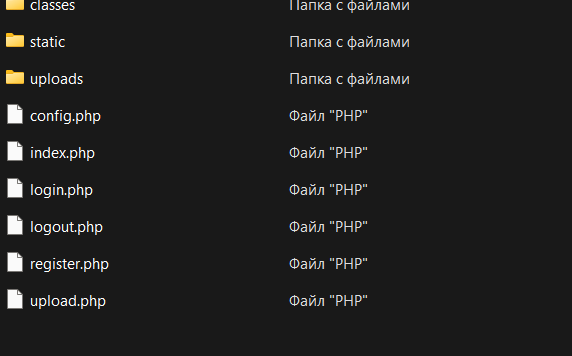
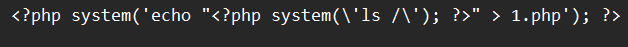
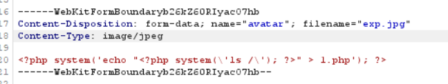
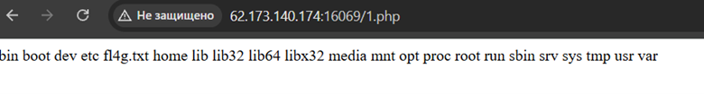
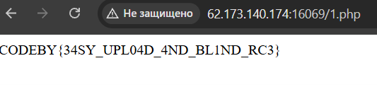

Решение: есть сайт с формой регистрации
 
 

Войдя внутрь мы можем загружать свою аватарку и очевидно, что вектор именно в этом.

 
 
Из исходников мы знаем, что сайт написан на php
 
Немного перешерстив интернет можно найти кучу эксплойтов, но у нас проблема, что вывод идет вместо картинки, а сам сервер php команды исполняет, но ввода нам не дает, следовательно, нам нужно куда-то записать вывод.

 
 
Загружаем php файл перехватывая запрос через Burp. Меняем формат и тип данных, чтобы они удовлетворяли условиям сервера.

 
 
По итогу имеем вот такой вывод в 1.php. Видим искомый флаг, остается лишь поменять системную команду внутри system c ls / на cat /fl4g.txt, чтобы вывело флаг.

 
 
В итоге находим искомый флаг.

 

Флаг: Вверху
