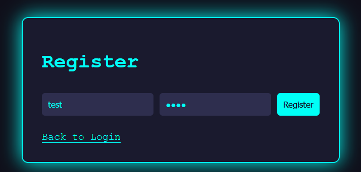
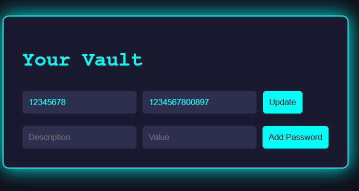

Решение: есть сайт с формой регистрации

 

Войдя внутрь мы можем добавлять свои секреты и менять их.

 
 
Просмотрев исходники нас заинтересовала одна функция. Мы видим, что её суть в том, чтобы, достать все пароли из бд по некому id.

 
 
Прогнав запросы через Burp видим, как это всё реализуется.

 

В ручке мы видим наш id. Попробуем перехватить запрос и изменить id на 1. В ответ нам прилетает флаг.

 
Флаг: Вверху
